# UX_UI_YOUTUBE

* **Curso:** _Creando tu primer sitio web interactivo_
* **Unidad:** _Intro a User Experience Design_

***
## Objetivo
En el siguiente reto se nos pide identificar los elementos de navegación en los siguientes sites:

- [Breather](https://breather.com/)
- [Github](https://github.com/)
- [Medium](https://medium.com/)

## Breather
* Navegación Global
***
Se muestra en todas las páginas del sitio para que el usuario pueda ubicarse dentro del sitio

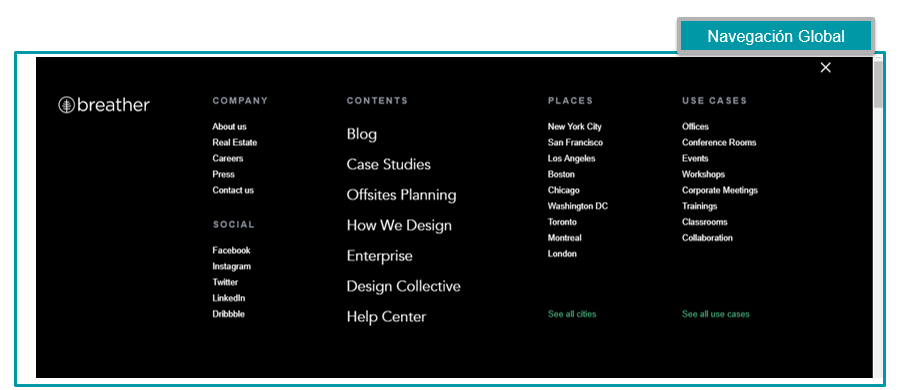
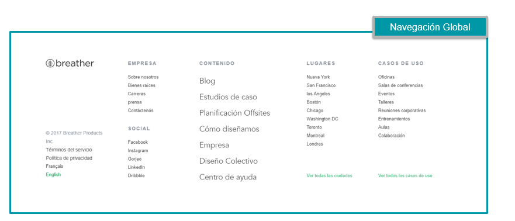
* Navegación Local
***
Encontramos este menu de opciones unicamente en la pestaña visitada, en este caso se ingreso a la vista Real Estate la cual tiene su propio menu de navegación

* Navegación Facetada
***
Le muestra opciones especificas sin opción a editar
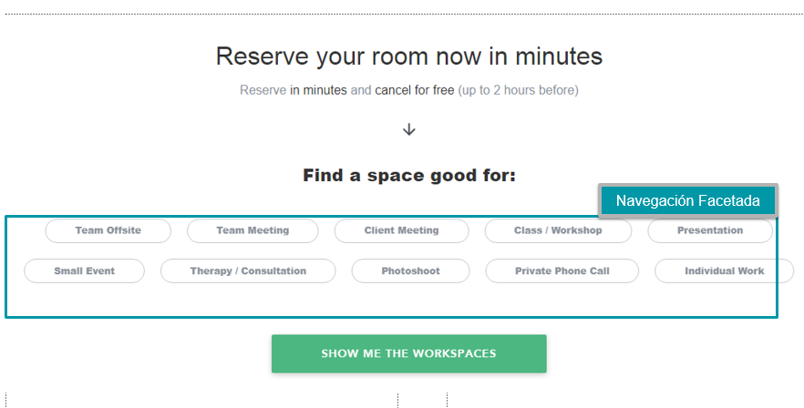
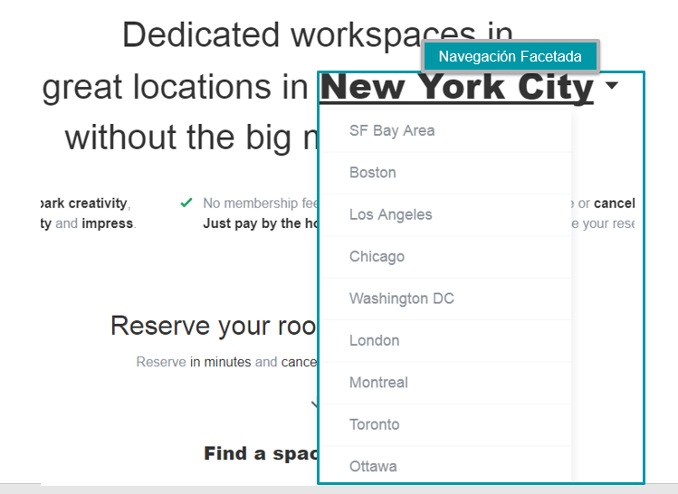
* Navegación Filtrada
***
Le permite al usuario editar los filtros para realizar una busqueda especifica
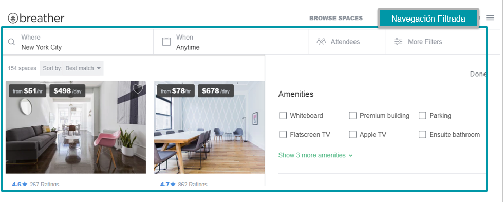
* Navegación en linea(Inline)
***
Encontramos links de referncia
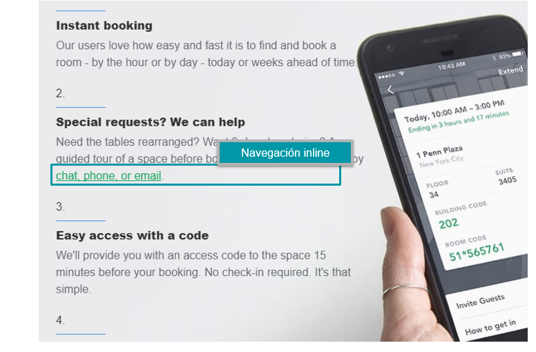
* Navegación Contextual
***
En este caso nos brinda recomendaciones de sitios a visitar según la vista en el que nos encontramos
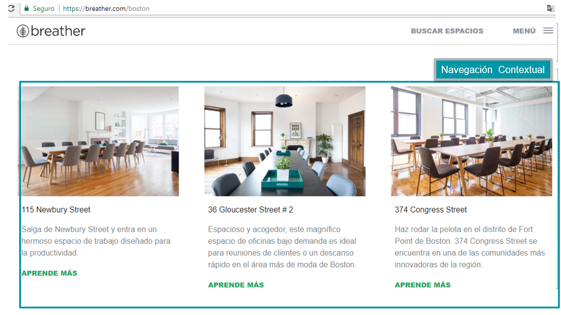

## Github
* Navegación Global
***
En este caso los siguientes son las barras de navegación global de Github

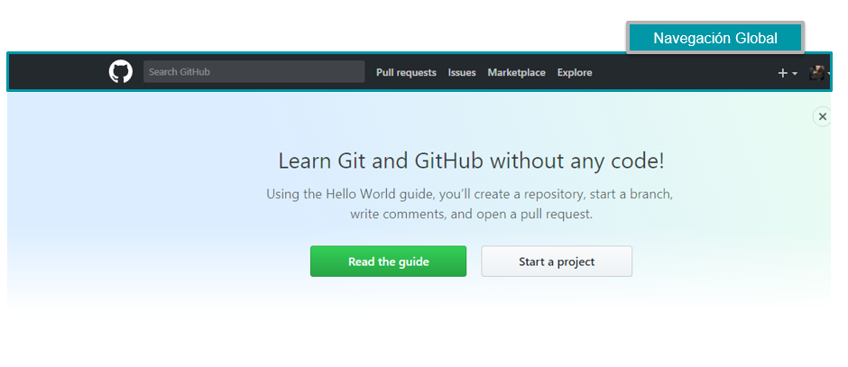

* Navegación local
***
Al ingresar a nuestro perfil en Github se nos muestra las barras de navegaciones locales en varias vistas del sitio las cuales nos ayudara a explorar esa vista en particular 
***
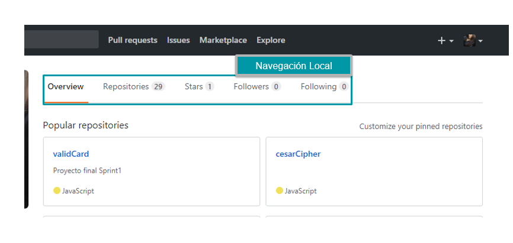
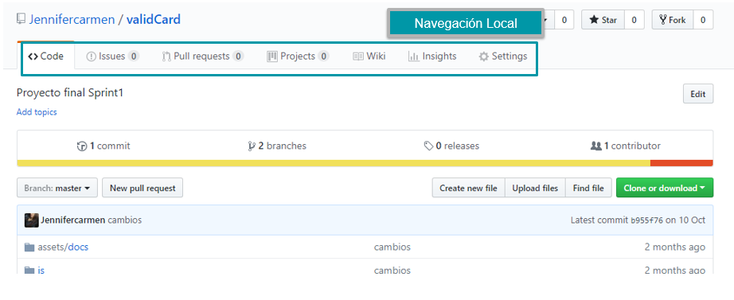
* Navegación Facetada
***
Github nos permite navegar a traves de filtros no editables como se muestra a continuación
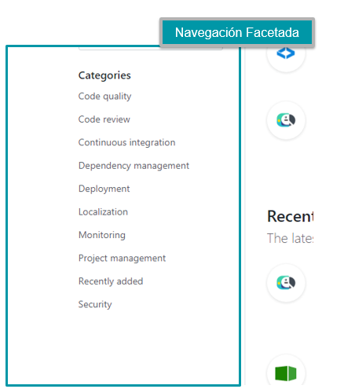
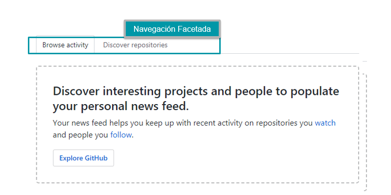
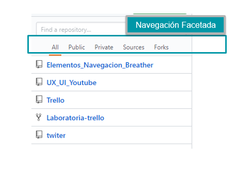
* Navegación en linea
***
Encontramos links de referencia en el sitio visitado
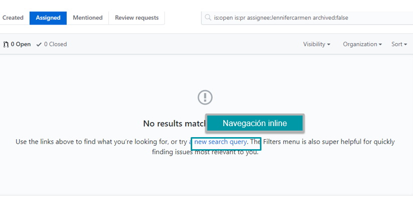
* Navegación Contextual
***
Github nos sugiere los siguientes articulos para leer según el sitio que estamos visitando.
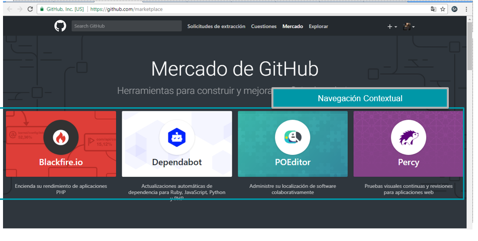

## Medium
* Navegación Global
***
Barra de navegación principal que se muestra en todo el sitio.
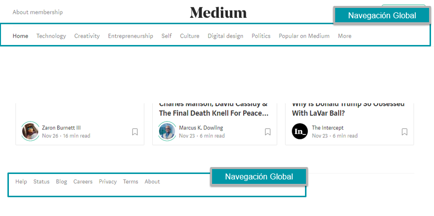
* Navegación Facetada
***
Nos permite filtrar la información que queremos ver sin opción a editarla 
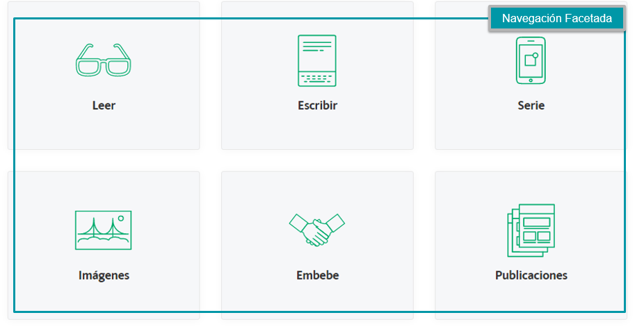
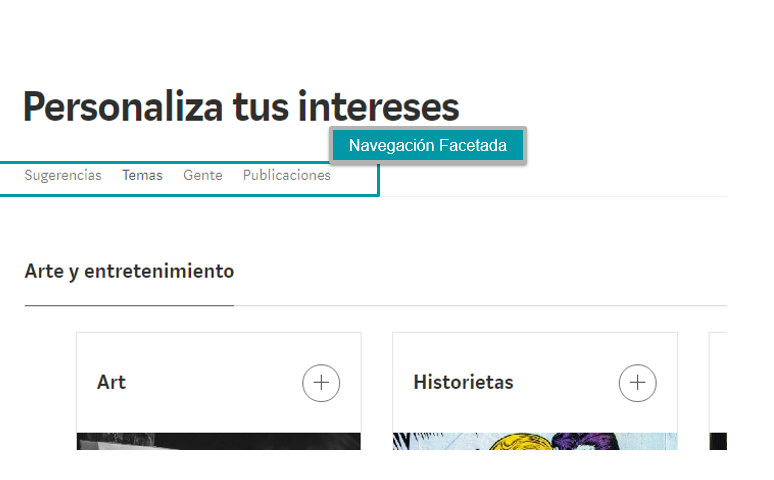
* Navegación en linea
***
Se nos muestran links de referencia en el articulo de la vista
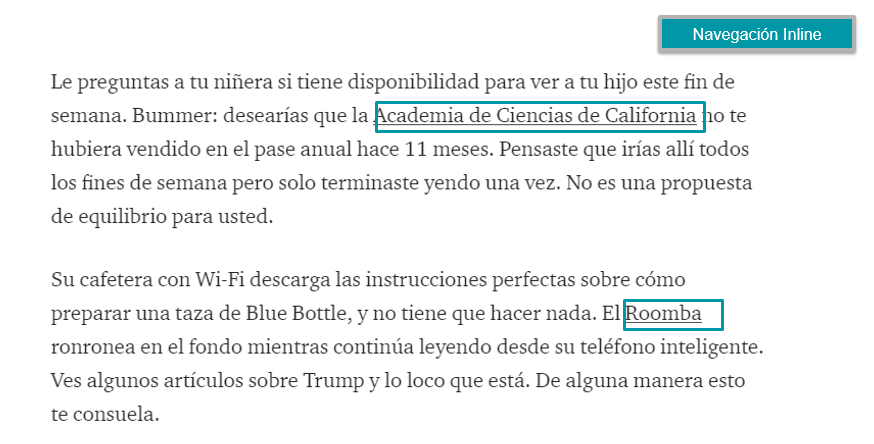
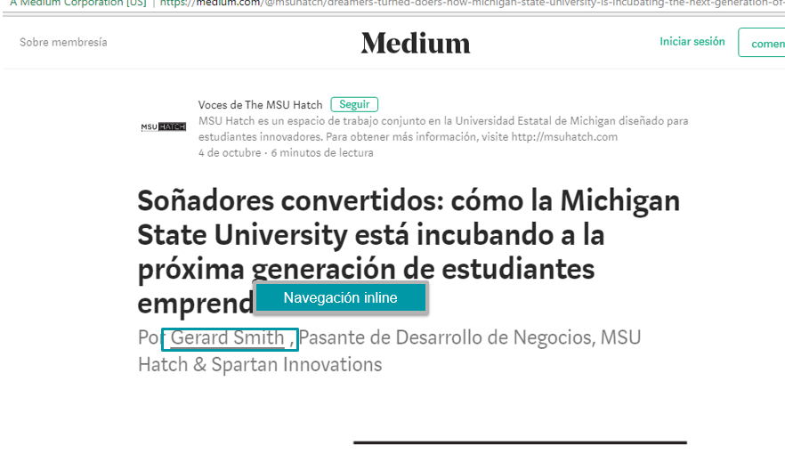
* Navegación Contextual
***
Nos ofrece una lista de opciones de acuerdo al contexto del sitio al que estamos visitando
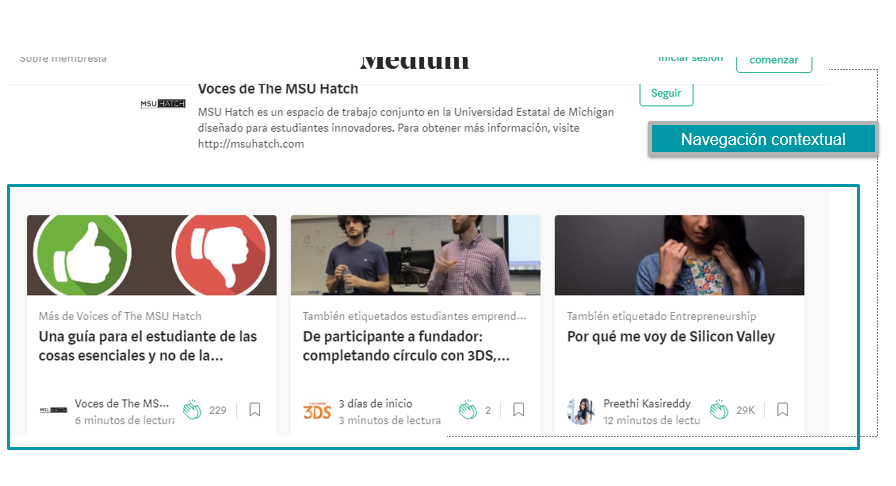
* Navegación Suplementaria
***
Medium nos muestra las siguientes ventanas temporalmente , la primera vez que visitamos su página
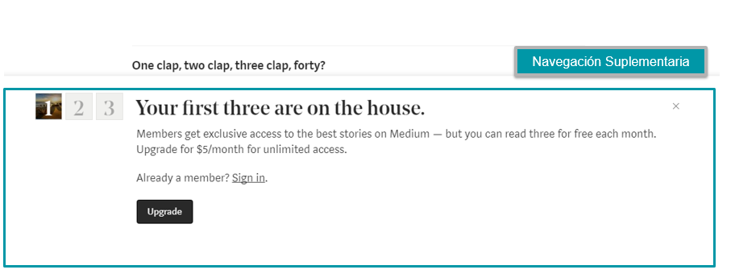

 
 ## Creditos

 JENNIFER CARMEN