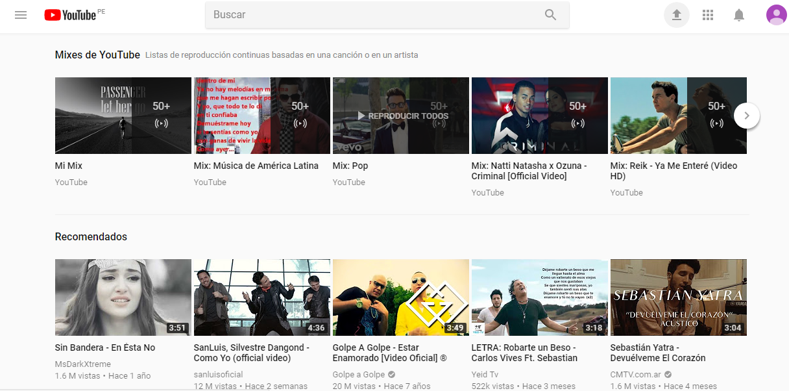
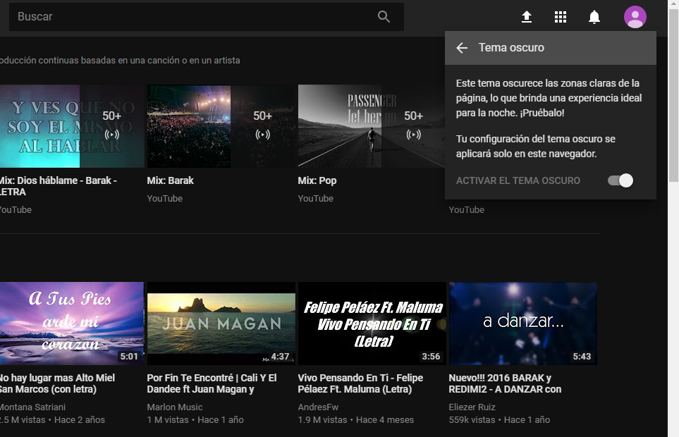
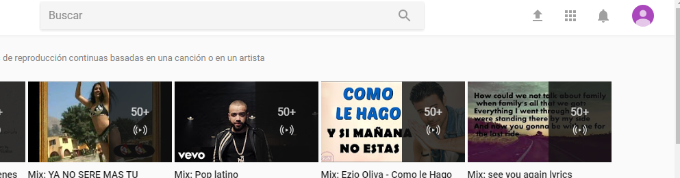
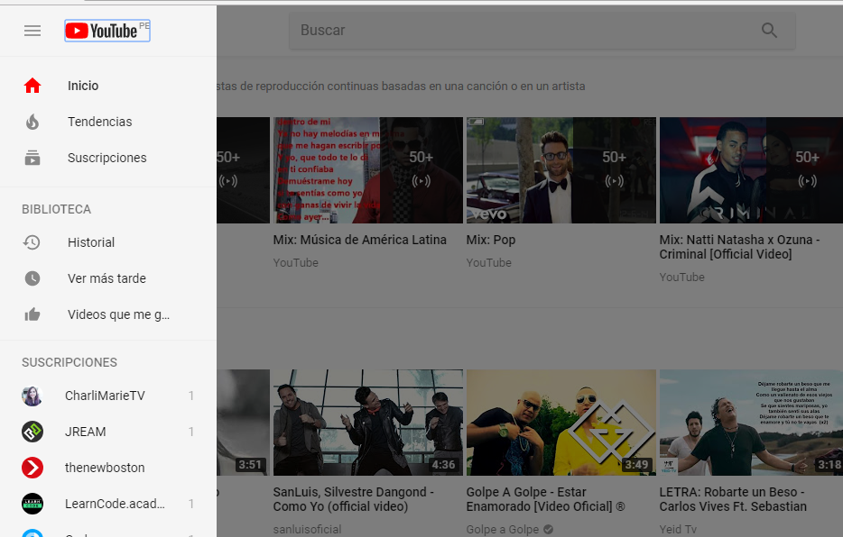
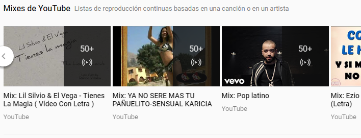
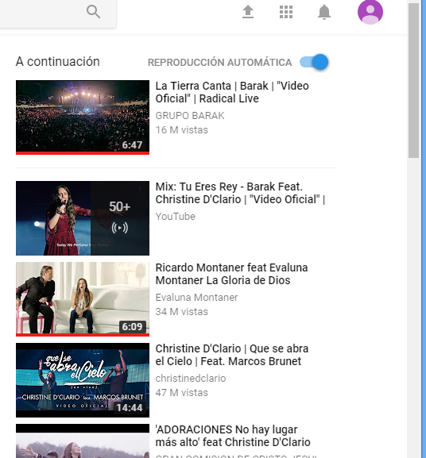
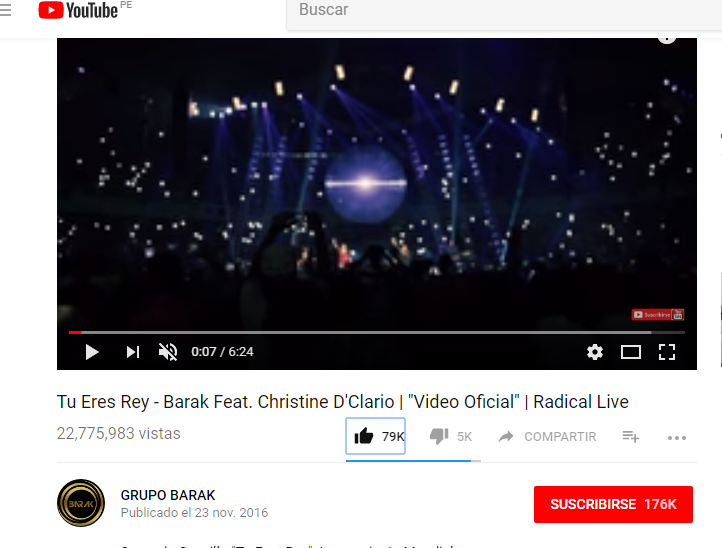
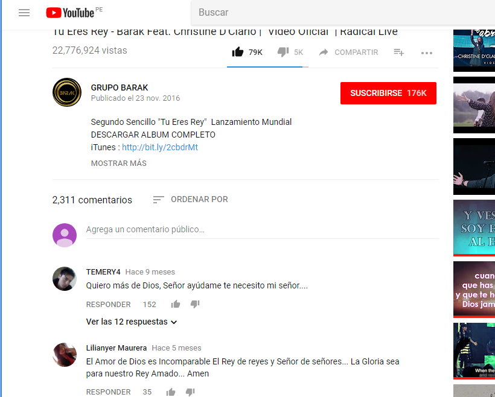

# UX_UI_YOUTUBE

* **Curso:** _Creando tu primer sitio web interactivo_
* **Unidad:** _Intro a User Experience Design_

***
## Partes que conforman el UX y UI de YouTube

## UI

- Que muestra una galería de videos basadas en mi historial
- Que recomienda videos basados en mis visitas
- Que muestra un menú de opciones Global con las opciones más relevantes.
- Que me sugiera videos basadas en mi historial 
- Que la calidad del video cambie automáticamente dependiendo de la velocidad de conexión
- Que muestra el número de vistas de video,  puntuaciones y comentarios.
- Que permite filtrar la vista de comentarios. 
- Que permita cambiar tamaño del reproductor de video(Modo teatro ,Pantalla completa)
- Que permita subtitular los videos
- Que cuente con reproducción automatica
- Que pueda tener su propio canal
- Que permita suscribirme a un canal de preferncia.
- Que llegue una notificación de nuevo video subido en el canal suscrito o de algun video recomendado según mis visitas
- Que permita realizar busquedas
- Que muestra elementos conocidos
- Que muestra un menu para configurar el perfil de usuario
- Que permite cambiar el idioma de la página.
- Que permite transmisiones en vivo
- Que permita configurar y administrar sus transmisiones en vivo
- Que tenga un diseño simple pero atractivo

## UI

- Diseño de contenido
- Diseño de los botones (Me gusta, No me gusta, Suscribirse, etc)
- Los colores de la marca (blanco y rojo)
- Diseño de los menús
- Diseño de menus desplegables
- Tamaño de videos
- La barra de avance en el consumo del contenido de  un video
- Tema oscuro que oscurece el fondo.
- Enlaces color celeste
- Tipografia
- Campo de búsqueda
- Diseño de barra derecha con elementos conocidos(Subir video, aplicaciones, notificaciones y usuario).
- Estados de selección en elementos conocidos
- Slider en mixes de YouTube
- Boton habilitado (color azul )en reproducción automatica
- Colores de Texto

 
 ## Creditos

 JENNIFER CARMEN.